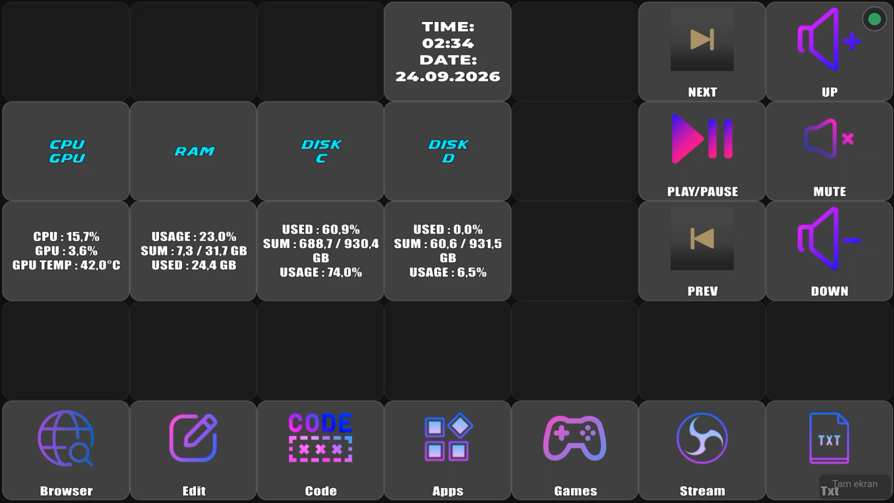
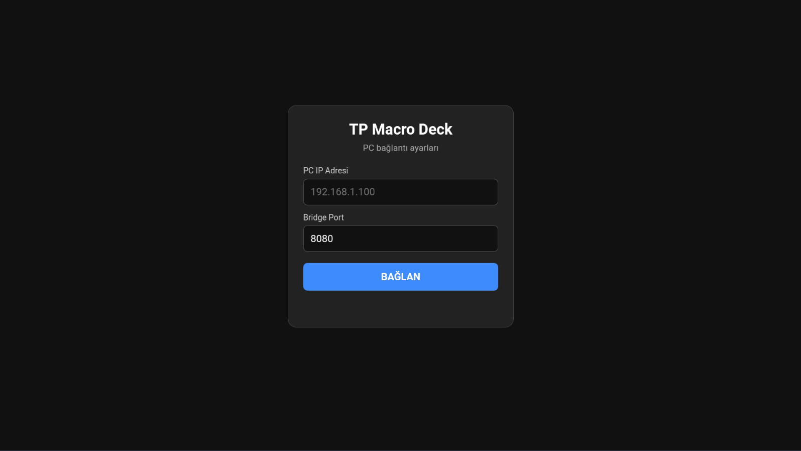
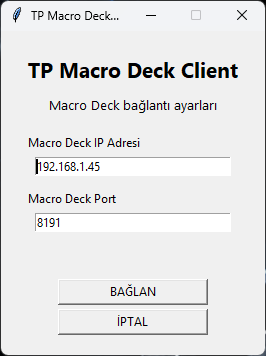
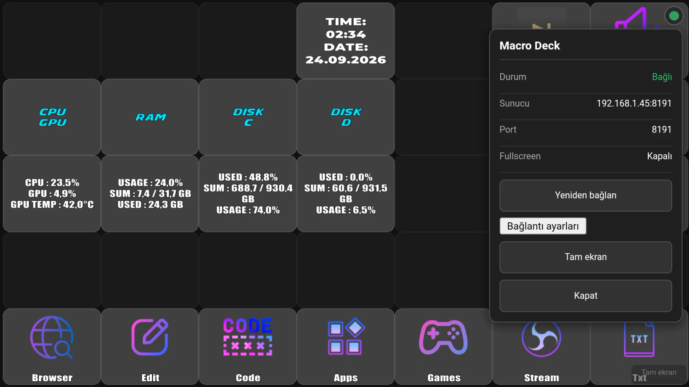

# 🎛️ TP Macro Deck

<p align="center">
  <strong>Android telefon ve tabletleri Macro Deck için modern bir kontrol paneline dönüştürün.</strong>
</p>

<p align="center">
  Windows üzerinde çalışan TP Macro Deck Server/Client ile Android cihaz arasında bağlantı kurarak Macro Deck butonlarını dokunmatik bir arayüz üzerinden kullanmanızı sağlar.
</p>

<p align="center">
  
  
  
</p>

---

## 📱 Proje Hakkında

**TP Macro Deck**, kullanılmayan Android telefon veya tabletleri bilgisayardaki **Macro Deck** sistemi için dokunmatik bir kontrol paneline dönüştürmek amacıyla geliştirilmiştir.

Android tarafındaki arayüz, Windows tarafındaki TP Macro Deck Server/Client üzerinden Macro Deck ile iletişim kurar.

### ✨ Özellikler

- 📱 Android telefon ve tablet desteği
- 🖥️ Windows Server / Client
- 📶 Wi-Fi üzerinden bağlantı
- 🔌 USB / ADB bağlantısı
- 🎛️ Macro Deck butonlarını Android cihazdan kullanma
- 🎮 Oyun ve uygulama kısayolları
- 🎙️ OBS ve yayın kontrolleri
- 🔊 Ses ve medya kontrolleri
- ⚡ Yerel ağ üzerinden hızlı bağlantı
- 🌐 İnternet bağlantısı gerektirmeden kullanım
- 🖥️ Tam ekran kontrol paneli

---

## 🧩 Sistem Mimarisi

### Wi-Fi

```text
┌──────────────────────┐
│    Android Client    │
│   📱 Telefon/Tablet  │
└──────────┬───────────┘
           │ Wi-Fi
           ▼
┌──────────────────────┐
│ TP Macro Deck Server │
│    🖥️ Windows PC     │
└──────────┬───────────┘
           │ WebSocket
           ▼
┌──────────────────────┐
│      Macro Deck      │
│      🎛️ Windows      │
└──────────────────────┘
```

### USB / ADB

```text
┌──────────────────────┐
│    Android Client    │
│         📱           │
└──────────┬───────────┘
           │ USB / ADB
           ▼
┌──────────────────────┐
│ TP Macro Deck Client │
│       🖥️ Windows     │
└──────────┬───────────┘
           │ WebSocket
           ▼
┌──────────────────────┐
│      Macro Deck      │
└──────────────────────┘
```

---

# 🖼️ Uygulama İçi Görüntüler

## 🎛️ Macro Deck Dashboard

TP Macro Deck üzerinde Macro Deck butonları, sistem monitörü, saat/tarih ve medya kontrolleri aynı arayüz içerisinde kullanılabilir.

<p align="center">
  
</p>

## 🔌 Android Bağlantı Ayarları

Android Client üzerinden Windows bilgisayarın IP adresi ve Bridge Port bilgileri girilerek bağlantı kurulabilir.

<p align="center">
  
</p>

## 🖥️ Windows Client

Windows tarafındaki TP Macro Deck Client üzerinden Macro Deck IP adresi ve port bilgileri yapılandırılır.

<p align="center">
  
</p>

## 📡 Bağlantı Durumu

Android arayüzü bağlantı durumunu, sunucu adresini ve port bilgisini görüntüleyebilir. Yeniden bağlanma ve tam ekran gibi kontroller de arayüz üzerinden kullanılabilir.

<p align="center">
  
</p>

---

# 📋 Gereksinimler

### Windows

- Windows bilgisayar
- [Macro Deck](https://macrodeck.org/)
- TP Macro Deck Windows Server/Client
- Wi-Fi veya desteklenen USB/ADB bağlantısı

### Android

- Android telefon veya tablet
- TP Macro Deck Android Client
- Wi-Fi veya desteklenen USB/ADB bağlantısı

### Ağ

Wi-Fi kullanımında Android cihaz ve Windows bilgisayar aynı yerel ağ üzerinde olmalıdır.

Örnek:

```text
PC      → 192.168.1.45
Android → 192.168.1.20
```

İnternet bağlantısı gerekli değildir.

---

# 🚀 Kurulum

## 1. Macro Deck

Windows bilgisayarınıza Macro Deck'i kurun ve çalıştırın.

## 2. Windows Server / Client

`windows-server` klasöründeki TP Macro Deck Client'ı çalıştırın.

Client, Android cihaz ile Macro Deck arasındaki iletişimi sağlar.

## 3. Windows IP adresini öğrenin

Windows CMD:

```cmd
ipconfig
```

`IPv4 Address` değerini bulun.

Örnek:

```text
192.168.1.45
```

## 4. Android Client

Android uygulamasını cihazınıza yükleyin.

Bağlantı ekranında Windows bilgisayarın IP adresini ve Bridge Port değerini girin.

```text
PC IP      : 192.168.1.45
Bridge Port: 8080
```

Ardından **BAĞLAN** butonuna basın.

> ⚠️ PC IP adresi olarak Android cihazın IP adresini değil, TP Macro Deck Server/Client'ın çalıştığı Windows bilgisayarın IP adresini kullanın.

---

# 🎯 Kullanım Alanları

- 🎙️ OBS kontrolü
- 🔴 Yayın başlatma / durdurma
- 🎤 Mikrofon kontrolü
- 🔊 Ses kontrolü
- 🎵 Spotify / medya kontrolü
- 🌐 Tarayıcı açma
- 💻 Program çalıştırma
- ⌨️ Klavye kısayolları
- 🎮 Oyun kısayolları
- ⚙️ Özel Macro Deck eylemleri
- 🖥️ Sistem bilgilerini görüntüleme

---

# 📁 Proje Yapısı

```text
TPMacroDeck/
│
├── android-client/
│   └── Android uygulaması
│
├── windows-server/
│   └── Windows TP Macro Deck Server / Client
│
├── docs/
│   └── screenshots/
│       ├── macrodeck-dashboard.png
│       ├── macrodeck-status.png
│       ├── android-connection.png
│       └── windows-client.png
│
├── README.md
├── LICENSE
└── .gitignore
```

---

# 🛠️ Bağlantı Sorunları

1. TP Macro Deck Server/Client'ın çalıştığından emin olun.
2. Macro Deck'in Windows bilgisayarda açık olduğunu kontrol edin.
3. Android ve Windows cihazın aynı Wi-Fi ağında olduğunu kontrol edin.
4. Windows bilgisayarın IP adresinin doğru olduğunu kontrol edin.
5. Bridge Port değerinin doğru olduğunu kontrol edin.
6. Windows Güvenlik Duvarı'nın bağlantıyı engellemediğinden emin olun.
7. TP Macro Deck Client'ı yeniden başlatın.
8. Android uygulamasından bağlantıyı yeniden deneyin.

---

# 🔧 Geliştirme

Projeye katkıda bulunmak, hata bildirmek veya yeni özellik önermek için GitHub Issues ve Pull Requests kullanılabilir.

Windows Server ve Android Client bölümleri ayrı olarak geliştirilebilir.

---

# 📄 Lisans

Bu proje **MIT License** altında dağıtılmaktadır.

Detaylar için [`LICENSE`](LICENSE) dosyasına bakabilirsiniz.

---

## 👤 Geliştirici

**TR POLARIS**

> TP Macro Deck — Android cihazınızı Macro Deck kontrol paneline dönüştürün.
