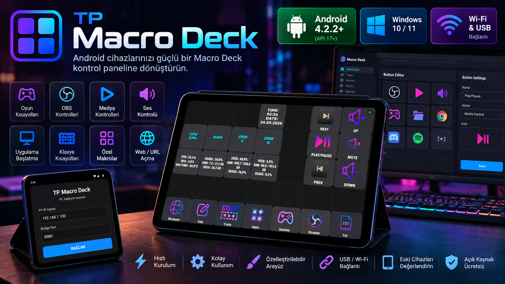

# 🎛️ TP Macro Deck

<p align="center">
  
</p>

<p align="center">
  <strong>Android 4.2.2+ cihazları Macro Deck için modern bir kontrol paneline dönüştürün.</strong>
</p>

<p align="center">
  TP Macro Deck, Android telefon ve tabletleri Windows üzerinde çalışan Macro Deck sistemiyle buluşturan açık kaynak bir Android Client ve Windows Server/Client çözümüdür.
</p>

<p align="center">
  
  
  
  
</p>

---

## 📱 Proje Hakkında

**TP Macro Deck**, kullanılmayan veya eski Android telefon ve tabletleri bilgisayardaki **Macro Deck** sistemi için dokunmatik bir kontrol paneline dönüştürmek amacıyla geliştirilmiştir.

Android tarafındaki arayüz, Windows tarafındaki TP Macro Deck Server/Client üzerinden Macro Deck ile iletişim kurar.

### 🟢 Android 4.2.2 ve Üzeri

TP Macro Deck Android Client, **Android 4.2.2 (API 17) ve üzeri** sürümleri hedefler.

Bu sayede eski Android telefon ve tabletler de Macro Deck kontrol paneli olarak değerlendirilebilir.

> **Minimum Android sürümü: Android 4.2.2 (API 17)**

> ⚠️ Android 4.2.2 veya üzeri olması minimum işletim sistemi gereksinimidir. Cihaz üreticisine, WebView sürümüne ve donanım özelliklerine bağlı olarak bazı özelliklerin kullanılabilirliği değişebilir.

---

## ✨ Özellikler

| Özellik | Açıklama |
|---|---|
| 📱 **Android 4.2.2+** | Android 4.2.2 (API 17) ve üzeri cihazlar için Client |
| 📲 Android Client | Telefon ve tabletlerde dokunmatik Macro Deck arayüzü |
| 🖥️ Windows Server / Client | Android ile Macro Deck arasında iletişim köprüsü |
| 📶 Wi-Fi | Yerel ağ üzerinden bağlantı |
| 🔌 USB / ADB | Desteklenen cihazlarda USB üzerinden bağlantı |
| 🎛️ Macro Deck | Macro Deck butonlarını Android cihazdan kullanma |
| 🎮 Kısayollar | Oyun, uygulama ve sistem kısayolları |
| 🎙️ OBS | OBS ve yayın kontrolleri |
| 🔊 Medya | Ses ve medya kontrolleri |
| ⚡ Yerel Ağ | İnternet bağlantısı olmadan kullanım |
| 🖥️ Fullscreen | Android cihazı özel kontrol paneli olarak kullanma |
| 🔄 Bağlantı Yönetimi | Bağlantı durumu ve yeniden bağlanma kontrolleri |

---

# 📱 Android Uyumluluğu

TP Macro Deck'in önemli hedeflerinden biri eski Android cihazları yeniden kullanılabilir hale getirmektir.

```text
Minimum
Android 4.2.2
API 17
   │
   ├── Android 4.x
   ├── Android 5.x
   ├── Android 6.x
   ├── Android 7.x
   ├── Android 8.x
   ├── Android 9.x
   ├── Android 10.x
   ├── Android 11.x
   ├── Android 12.x
   ├── Android 13.x
   ├── Android 14.x
   └── Android 15.x+
```

**Minimum sürüm:** `Android 4.2.2 / API 17`

Eski tabletler ve telefonlar, yeterli donanım ve uyumlu WebView bulunduğu sürece Macro Deck için ikinci bir ekran veya dokunmatik kontrol paneli olarak değerlendirilebilir.

---

## 🧩 Sistem Mimarisi

### 📶 Wi-Fi

```text
┌──────────────────────────┐
│     Android Client       │
│   📱 Android 4.2.2+      │
└────────────┬─────────────┘
             │
             │ Wi-Fi
             ▼
┌──────────────────────────┐
│  TP Macro Deck Server    │
│       🖥️ Windows         │
└────────────┬─────────────┘
             │
             │ WebSocket
             ▼
┌──────────────────────────┐
│       Macro Deck         │
│        🎛️ Windows        │
└──────────────────────────┘
```

### 🔌 USB / ADB

```text
┌──────────────────────────┐
│     Android Client       │
│   📱 Android 4.2.2+      │
└────────────┬─────────────┘
             │
             │ USB / ADB
             ▼
┌──────────────────────────┐
│  TP Macro Deck Client    │
│       🖥️ Windows         │
└────────────┬─────────────┘
             │
             │ WebSocket
             ▼
┌──────────────────────────┐
│       Macro Deck         │
└──────────────────────────┘
```

---

# 🖼️ Uygulama İçi Görüntüler

## 🎛️ Macro Deck Dashboard

Macro Deck butonları, sistem monitörü, saat/tarih ve medya kontrolleri Android cihaz üzerinde aynı arayüz içerisinde kullanılabilir.

<p align="center">
  
</p>

## 🔌 Android Bağlantı Ayarları

Android Client üzerinde Windows bilgisayarın IP adresi ve Bridge Port bilgileri girilerek bağlantı kurulabilir.

<p align="center">
  
</p>

## 🖥️ Windows Client

Windows tarafındaki TP Macro Deck Client üzerinden Macro Deck IP adresi ve port bilgileri yapılandırılır.

<p align="center">
  
</p>

## 📡 Bağlantı Durumu

Android arayüzü bağlantı durumunu, sunucu adresini ve port bilgisini görüntüleyebilir. Yeniden bağlanma ve tam ekran kontrolleri de arayüz üzerinden kullanılabilir.

<p align="center">
  
</p>

---

# 📋 Gereksinimler

## 🖥️ Windows

- Windows bilgisayar
- [Macro Deck](https://macrodeck.org/)
- TP Macro Deck Windows Server/Client
- Wi-Fi veya desteklenen USB/ADB bağlantısı

## 📱 Android

- **Android 4.2.2 (API 17) veya üzeri**
- Android telefon veya tablet
- TP Macro Deck Android Client
- Wi-Fi veya desteklenen USB/ADB bağlantısı

## 🌐 Ağ

Wi-Fi kullanımında Android cihaz ve Windows bilgisayar aynı yerel ağ üzerinde olmalıdır.

Örnek:

```text
PC      → 192.168.1.45
Android → 192.168.1.20
```

İnternet bağlantısı gerekli değildir.

---

# 🚀 Kurulum

## 1️⃣ Macro Deck

Windows bilgisayarınıza Macro Deck'i kurun ve çalıştırın.

## 2️⃣ Windows Server / Client

`windows-server` klasöründeki TP Macro Deck Client'ı çalıştırın.

Client, Android cihaz ile Macro Deck arasındaki iletişimi sağlar.

## 3️⃣ Windows IP adresini öğrenin

Windows CMD'yi açın:

```cmd
ipconfig
```

`IPv4 Address` değerini bulun.

Örnek:

```text
192.168.1.45
```

## 4️⃣ Android Client'ı kurun

Android cihazınızın **Android 4.2.2 veya üzeri** olduğundan emin olun.

APK'yı telefon veya tabletinize yükleyin.

Bağlantı ekranında Windows bilgisayarın IP adresini ve Bridge Port değerini girin:

```text
PC IP      : 192.168.1.45
Bridge Port: 8080
```

Ardından **BAĞLAN** butonuna basın.

> ⚠️ PC IP adresi olarak Android cihazın IP adresini değil, TP Macro Deck Server/Client'ın çalıştığı Windows bilgisayarın IP adresini kullanın.

---

# 🎯 Kullanım Alanları

- 🎙️ OBS kontrolü
- 🔴 Yayın başlatma / durdurma
- 🎤 Mikrofon kontrolü
- 🔊 Ses kontrolü
- 🎵 Spotify / medya kontrolü
- 🌐 Tarayıcı açma
- 💻 Program çalıştırma
- ⌨️ Klavye kısayolları
- 🎮 Oyun kısayolları
- ⚙️ Özel Macro Deck eylemleri
- 🖥️ Sistem bilgilerini görüntüleme

---

# ♻️ Eski Android Cihazlar İçin

TP Macro Deck'in temel kullanım senaryolarından biri, artık günlük kullanımda tercih edilmeyen eski Android telefon ve tabletleri değerlendirmektir.

```text
Eski Android Tablet
       │
       │ Android 4.2.2+
       ▼
┌─────────────────────┐
│   TP Macro Deck     │
│                     │
│  🎛️ Macro Deck      │
│  🎙️ OBS             │
│  🔊 Media           │
│  🎮 Games           │
│  💻 Apps            │
└─────────────────────┘
```

Böylece ayrı bir fiziksel kontrol paneli satın almadan mevcut Android cihazınızı Macro Deck arayüzü olarak kullanabilirsiniz.

---

# 📁 Proje Yapısı

```text
TPMacroDeck/
│
├── android-client/
│   └── Android 4.2.2+ uygulaması
│
├── windows-server/
│   └── Windows TP Macro Deck Server / Client
│
├── docs/
│   └── screenshots/
│       ├── TPMacroDeck-cover.png
│       ├── macrodeck-dashboard.png
│       ├── macrodeck-status.png
│       ├── android-connection.png
│       └── windows-client.png
│
├── README.md
├── LICENSE
└── .gitignore
```

---

# 🛠️ Bağlantı Sorunları

Bağlantı kurulamazsa:

1. TP Macro Deck Server/Client'ın çalıştığından emin olun.
2. Macro Deck'in Windows bilgisayarda açık olduğunu kontrol edin.
3. Android cihazın **Android 4.2.2 veya üzeri** olduğunu kontrol edin.
4. Android ve Windows cihazın aynı Wi-Fi ağında olduğunu kontrol edin.
5. Windows bilgisayarın IP adresinin doğru olduğunu kontrol edin.
6. Bridge Port değerinin doğru olduğunu kontrol edin.
7. Windows Güvenlik Duvarı'nın bağlantıyı engellemediğinden emin olun.
8. TP Macro Deck Client'ı yeniden başlatın.
9. Android uygulamasından bağlantıyı yeniden deneyin.

---

# 🔧 Geliştirme

Projeye katkıda bulunmak, hata bildirmek veya yeni özellik önermek için GitHub Issues ve Pull Requests kullanılabilir.

Windows Server ve Android Client bölümleri ayrı olarak geliştirilebilir.

---

# 📄 Lisans

Bu proje **MIT License** altında dağıtılmaktadır.

Detaylar için [`LICENSE`](LICENSE) dosyasına bakabilirsiniz.

---

## 👤 Geliştirici

**TR POLARIS**

<p align="center">
  <strong>TP Macro Deck</strong><br>
  Android 4.2.2+ cihazınızı Macro Deck kontrol paneline dönüştürün.
</p>
